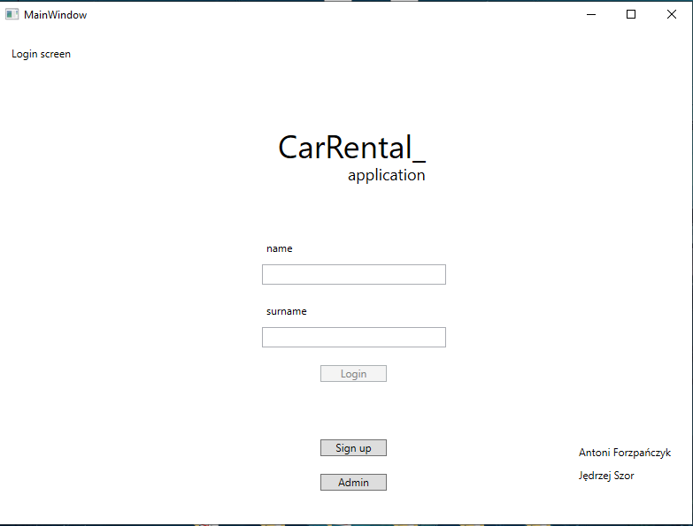
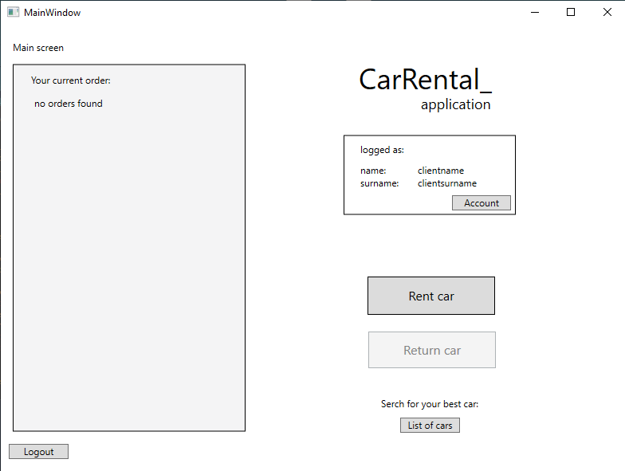
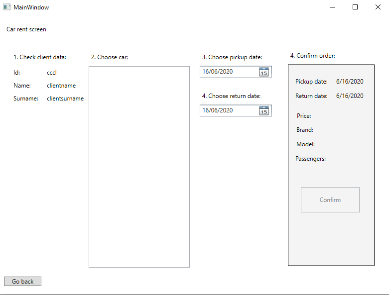

# Car-Rental

Project realized on PŁ - Technical University of Lodz as a paticipant of Programming Technology subject. Application is a simple C# application realized with WPF graphical subsystem. Program imitates the car rental functionalities:
* logging in or registering new account
* renting car with some requirements
* returning car and giving feedback
* displaying all cars
* access to admin functionalities

Implementation of the project inludes usage of two patterns:
* whole app was made in MVVM model to distingiush logical and GUI part
* IObservable interface with binded properties

In addition, data is stored locally in SQLServer database associated to whole logical part of the program.

Project was created using Visual Studio.

Authors: Antoni Forzpańczyk & Jędrzej Szor

Main menu:

  

Main view:

  

Renting car:

  

